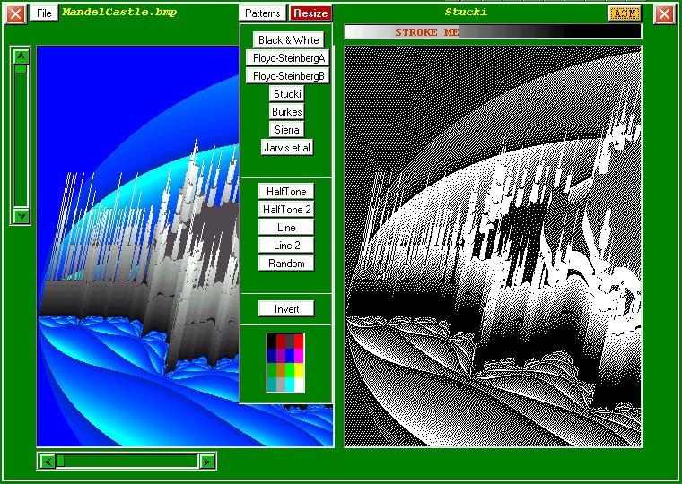



## Dither\(Updated\)

### Description

Dither by Robert Rayment. (Updated 26/11/02 Jump table used in ASM, 2-color saving corrected, improved scroll bars) This produces a 2-color bitmap from any original using a variety of methods and can be saved or printed. The program can be run in VB or VB+ASM. The structure of the asm file roughly follows that of the VB code and so should be useful for those new to assembler. The asm code is in a bin file but could be stored in a res file or made into a dll or a class (see buggy). See Notes.txt for more info. Zip 59KB, Win98 & exe tested on WinXP.
 
### More Info
 
pictures

just run

2 color pictures

             |
---                |---
**Submitted On**   |2002-11-22 18:34:12
**By**             |[Robert Rayment](https://github.com/Planet-Source-Code/PSCIndex/blob/master/ByAuthor/robert-rayment.md)
**Level**          |Advanced
**User Rating**    |5.0 (60 globes from 12 users)
**Compatibility**  |VB 6\.0
**Category**       |[Graphics](https://github.com/Planet-Source-Code/PSCIndex/blob/master/ByCategory/graphics__1-46.md)
**World**          |[Visual Basic](https://github.com/Planet-Source-Code/PSCIndex/blob/master/ByWorld/visual-basic.md)
**Archive File**   |[Dither\(Upd15037911262002\.zip](https://github.com/Planet-Source-Code/robert-rayment-dither-updated__1-40686/archive/master.zip)

### API Declarations

Several see code

